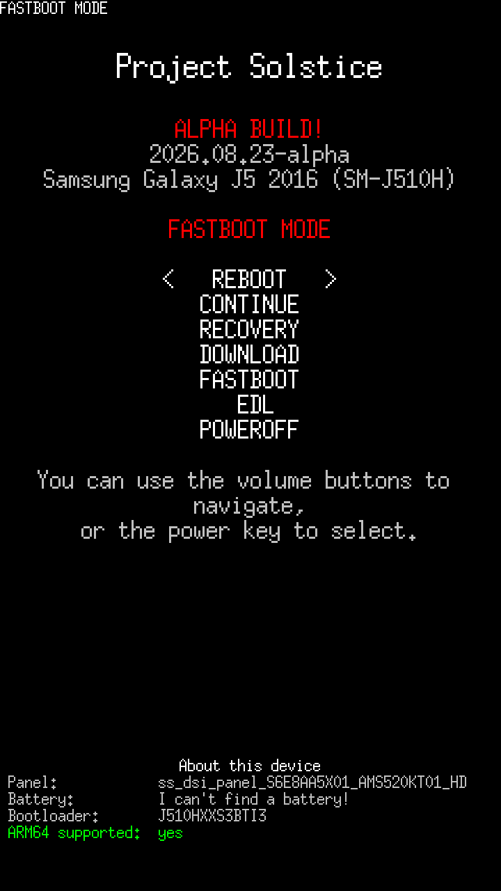

# Project Solstice

A heavily modified lk2nd fork made to be better (fun fact: the name is literally a oneshot reference XD)

 <i>a alpha build is shown in the screenshot, so expect things to be different maybe</i>

This thing is being tested only on a Samsung Galaxy J5 2016 (SM-J510H) and also on a Huawei MediaPad T3 10 (AGS-W09), so some stuff might be broken on other devices

## Known issues :P
moved to [here](Solstice_Documentation_and_Misc/Known_Issues.md)
